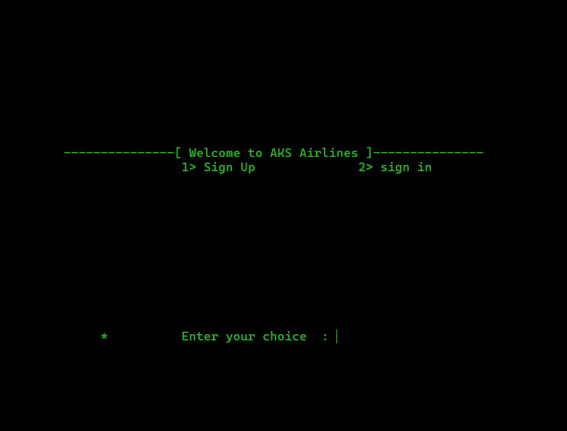

# Airlines-Booking-System
Airlines-Booking-System is a C++ console application simulating an airline booking platform. Users can sign up, sign in, book flights, check in, and manage accounts via a text-based interface. Features include user authentication, flight selection, PNR generation, and account management.

## Features

- **User Authentication**
  - **Sign Up:** Create a new account by providing personal details, setting a password, and answering security questions.
  - **Sign In:** Access your account using your User ID and password.

- **Flight Booking**
  - **Select Departure and Arrival:** Choose from a list of international airports to book your flight.
  - **PNR Generation:** Receive a unique Passenger Name Record (PNR) for your booking.

- **Check-In**
  - **Flight Code Verification:** Enter your flight code and username to check in for your flight.
  - **Boarding Pass:** Receive confirmation that your boarding pass has been sent to your email.

- **Manage Flight**
  - **View Facilities:** Access information about different classes such as First Class, Executive Class, and Economy Class.
  - **Cancel Booking:** Cancel your flight booking with ease.
  - **Update Account Info:** Change your password or username.

- **Account Management**
  - **Secure Payment Information:** Save your credit card, debit card, or UPI details securely.
  - **Visa Management:** Enter and manage your visa information for international travel.

- **About & Contact**
  - **Company Information:** Learn about AKS Airlines, its history, and services.
  - **Customer Support:** Access contact information for support and inquiries.

## Screenshot

